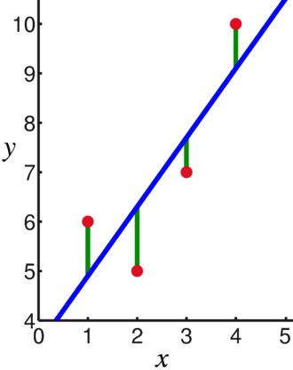

## Linear Regression

선형 회귀는 가장 대표적인 회귀 알고리즘이다. 상대적으로 간단하고 성능이 뛰어나다. 2차원 좌표상에 임의의 점들이 흩어져 있다고 상상했을때 그 점들을 가장 예쁘게 지나는 선을 긋는다고 생각하면 쉽다.

흩어진 점들 간의 관계를 y = ax + b 식으로 풀어내면, 모든 점들을 가장 잘 만족시키는 a 와 b를 구할 수 있다. 여기서 a는 coefficient, b는 intercept 라고 한다.

[source: wikipedia](https://en.wikipedia.org/wiki/Linear_regression)